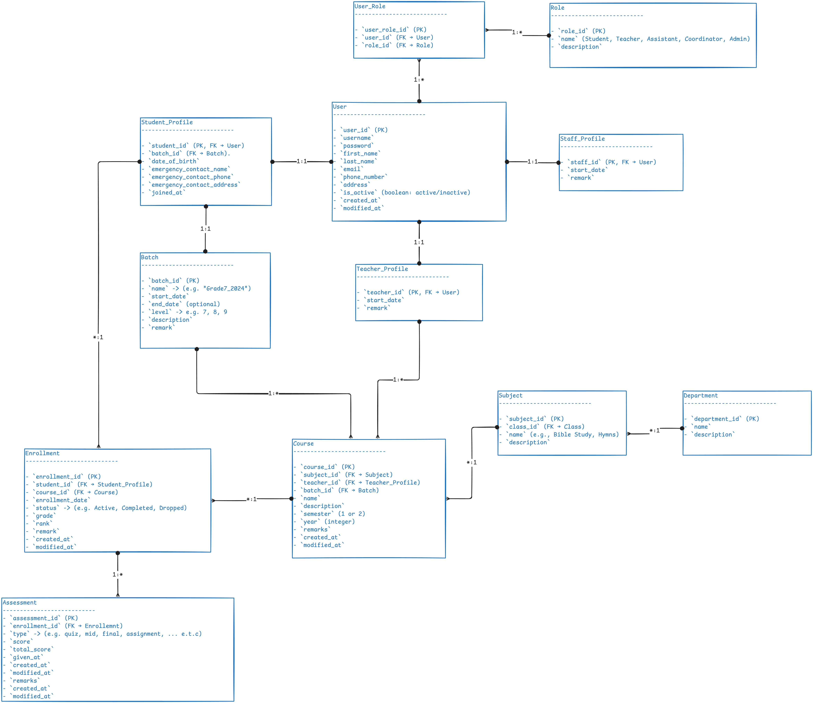

# 📘 Database Documentation

This document describes the database schema of the **Ewket Birhane Student Management System**, based on the finalized ERD. The system supports user management, academic structuring, student enrollment, course offerings, and performance tracking.

Here is the ERD diagram for reference:

---

## 🧑‍💻 User and Role Management

### `User`

Stores authentication and general identity information for all system users.

| Field          | Description                   |
| -------------- | ----------------------------- |
| `user_id` (PK) | Unique ID for the user        |
| `username`     | Unique login identifier       |
| `password`     | User password                 |
| `first_name`   | First name of the user        |
| `last_name`    | Last name of the user         |
| `email`        | Email address                 |
| `phone_number` | Contact phone                 |
| `address`      | Physical address              |
| `is_active`    | Boolean flag: active/inactive |
| `created_at`   | Record creation timestamp     |
| `modified_at`  | Last modification timestamp   |

### `Role`

Defines user roles in the system.

| Field          | Description                                                      |
| -------------- | ---------------------------------------------------------------- |
| `role_id` (PK) | Unique role ID                                                   |
| `name`         | Role name (e.g. Student, Teacher, Assistant, Coordinator, Admin) |
| `description`  | Role description                                                 |

### `User_Role`

Associative entity that maps users to roles (many-to-many relationship).

| Field           | Description                        |
|------------------|------------------------------------|
| `user_role_id` (PK) | Unique ID                     |
| `user_id` (FK)   | Linked user                       |
| `role_id` (FK)   | Linked role                       |

---
## 🧑‍🎓 User Profiles

### `Student_Profile`

Stores extended student-specific data.

| Field                       | Description                    |
| --------------------------- | ------------------------------ |
| `student_id` (PK, FK)       | Linked to `User` table         |
| `batch_id` (FK)             | Student's assigned batch       |
| `date_of_birth`             | DOB of the student             |
| `emergency_contact_name`    | Emergency contact name         |
| `emergency_contact_phone`   | Emergency contact phone number |
| `emergency_contact_address` | Emergency contact address      |
| `joined_at`                 | Date of joining the school     |

### `Teacher_Profile`

Stores extended teacher-specific data.

| Field          | Description                 |
|----------------|-----------------------------|
| `teacher_id` (PK, FK) | Linked to `User`     |
| `start_date`   | Employment start date       |
| `remark`       | Notes or remarks            |

### `Staff_Profile`

Stores extended staff-specific data (Admin, Coordinator, etc.).

| Field         | Description                  |
|---------------|------------------------------|
| `staff_id` (PK, FK) | Linked to `User`       |
| `start_date`  | Employment start date        |
| `remark`      | Notes or remarks             |

---
## 🎓 Academic Structuring

### `Batch`

Groups students into cohorts (e.g. `Grade7_2024`).

| Field           | Description                              |
| --------------- | ---------------------------------------- |
| `batch_id` (PK) | Unique batch ID                          |
| `name`          | Auto-generated from level and start year |
| `start_date`    | Start of academic period                 |
| `end_date`      | (Optional) end date                      |
| `level`         | Grade level (e.g., 7, 8, 9)              |
| `description`   | Notes                                    |
| `remark`        | Additional info                          |

### `Department`

Defines academic departments (e.g. Theology, Music).

| Field             | Description         |
|-------------------|---------------------|
| `department_id` (PK) | Unique department |
| `name`            | Department name     |
| `description`     | Description         |

### `Subject`

Defines subjects taught in the system.

| Field           | Description                  |
|------------------|------------------------------|
| `subject_id` (PK)| Unique subject               |
| `class_id` (FK)  | Related class group          |
| `name`          | Subject title (e.g. Hymns)    |
| `description`   | Subject description           |

---
## 📚 Course & Enrollment

### `Course`

Represents a subject offered to a batch in a specific year/semester.

| Field         | Description                            |
|---------------|----------------------------------------|
| `course_id` (PK)| Unique course ID                    |
| `subject_id` (FK)| Subject being taught               |
| `teacher_id` (FK)| Teacher assigned to course         |
| `batch_id` (FK)  | Targeted student batch             |
| `name`        | Course name                          |
| `description` | Description                          |
| `semester`    | Semester offered (1 or 2)            |
| `year`        | Academic year (e.g., 2024)           |
| `remarks`     | Extra notes                          |
| `created_at`  | Created timestamp                    |
| `modified_at` | Last updated timestamp               |

📌 **Constraint:** Unique on (`subject_id`, `teacher_id`, `batch_id`, `semester`, `year`)

### `Enrollment`

Tracks student enrollment in a course.

| Field           | Description                        |
|------------------|------------------------------------|
| `enrollment_id` (PK)| Unique enrollment ID          |
| `student_id` (FK) | Linked student                  |
| `course_id` (FK)  | Linked course                   |
| `enrollment_date`| Date of enrollment               |
| `status`         | Active, Completed, or Dropped    |
| `grade`          | Final grade                      |
| `rank`           | Class rank                       |
| `remark`         | Additional notes                 |
| `created_at`     | Created timestamp                |
| `modified_at`    | Modified timestamp               |

📌 **Constraint:** Unique on (`student_id`, `course_id`)

---
## 📝 Assessment

### `Assessment`

Stores individual scores for a student's course performance.

| Field             | Description                            |
|-------------------|----------------------------------------|
| `assessment_id` (PK)| Unique assessment                   |
| `enrollment_id` (FK)| Linked enrollment                  |
| `type`            | Assessment type (quiz, mid, final...)  |
| `score`           | Obtained score                         |
| `total_score`     | Maximum possible score                 |
| `given_at`        | Date assigned                          |
| `created_at`      | Created timestamp                      |
| `modified_at`     | Modified timestamp                     |
| `remarks`         | Notes or context                       |

---
## 🔗 Relationships Summary

- `User` connects 1:1 with `Student_Profile`, `Teacher_Profile`, or `Staff_Profile`
- `User` connects M:N with `Role` through `User_Role`
- `Student_Profile` links to `Batch`
- `Subject` links to `Department`
- `Course` links to `Subject`, `Teacher_Profile`, `Batch`
- `Enrollment` links students to courses
- `Assessment` links to enrollments (multiple per enrollment)

